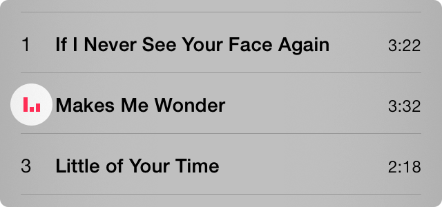

[](https://cocoapods.org/pods/NAKPlaybackIndicatorView)
[](https://travis-ci.org/yujinakayama/NAKPlaybackIndicatorView)

#  NAKPlaybackIndicatorView



**NAKPlaybackIndicatorView** is a view that mimics the music playback indicator in the Music.app on iOS.
It has some vertical bars and they oscillate randomly.

Requires iOS 8.0 or later.

## Trying the Demo App

You can try the demo app instantly with [CocoaPods](http://cocoapods.org):

```bash
# This will open an Xcode workspace
$ pod try NAKPlaybackIndicatorView
```

In the opened workspace, choose the **Demo** scheme and run.

## Installation

NAKPlaybackIndicatorView is available through CocoaPods,
to install it simply add the following line to your `Podfile`:

```ruby
pod 'NAKPlaybackIndicatorView'
```

Then run `pod install`.

## Basic Usage

Here's a basic example:

```objective-c
#import <NAKPlaybackIndicatorView/NAKPlaybackIndicatorView.h>

- (void)viewDidLoad
{
    [super viewDidLoad];

    NAKPlaybackIndicatorViewStyle *style = [NAKPlaybackIndicatorViewStyle iOS7Style];
    NAKPlaybackIndicatorView *indicator = [[NAKPlaybackIndicatorView alloc] initWithStyle:style];
    [self.view addSubview:indicator];
    [indicator sizeToFit];

    // Initially the `state` property is NAKPlaybackIndicatorViewStateStopped
    // and the `hidesWhenStopped` property is YES.
    // Thus, the view is hidden at this time.

    // The view appears and the bars start animation.
    indicator.state = NAKPlaybackIndicatorViewStatePlaying;

    // The bars stop animation and become idle.
    indicator.state = NAKPlaybackIndicatorViewStatePaused;

    // The view becomes hidden.
    indicator.state = NAKPlaybackIndicatorViewStateStopped;
}
```

You can use NAKPlaybackIndicatorView in both code and Storyboard, and it works well with both Auto Layout and frame-based layout.

### Code with Auto Layout

```objective-c
NAKPlaybackIndicatorView *indicator = [[NAKPlaybackIndicatorView alloc] initWithFrame:CGRectZero];
indicator.translatesAutoresizingMaskIntoConstraints = NO;
[self.view addSubview:indicator];

// Then, add some positioning layout constraints.
// Note that normally you don't need to add sizing constraints
// since NAKPlaybackIndicatorView has an intrinsic content size.
// It will be automatically resized to fit its content.
```

### Code with Frame-Based Layout

```objective-c
NAKPlaybackIndicatorView *indicator = [[NAKPlaybackIndicatorView alloc] initWithFrame:CGRectZero];
[self.view addSubview:indicator];
[indicator sizeToFit]; // Resize itself to fit its content.
```

### Storyboard with Auto Layout

1. Put a `UIView` on your view.
2. Set its custom class to `NAKPlaybackIndicatorView`.
3. In the **Size Inspector** (⌥⌘5), set the **Intrinsic Size** to **Placeholder** and set the width to 12 and the height to 12. Note that this is just for convenience of the appearance on the Storyboard, and the placeholder size won't be used at runtime.
4. Add some positioning layout constraints.

### Storyboard with Frame-Based Layout

1. Put a `UIView` on your view.
2. Set its custom class to `NAKPlaybackIndicatorView`.
3. In the **Size Inspector** (⌥⌘5), set the width to 12 and the height to 12.

## Customization

### Bar Count, Size, and Spacing

Bars can be customized via `NAKPlaybackIndicatorViewStyle`.

### Color

The color of the bars can be changed by setting `tintColor` property (`UIView`) of the view or its ancestor view.

### View Size

Normally the view can be automatically resized to fit its content by:

* Omitting sizing constraints in Auto Layout, since it has an intrinsic content size.
* Calling `sizeToFit` in frame-based layout.

Or if you explicitly specify size, the bars will be placed in the center of the view.

## Class Reference

NAKPlaybackIndicatorView's class reference is available on [CocoaDocs.org](http://cocoadocs.org/docsets/NAKPlaybackIndicatorView/0.1.0).

## License

Copyright (c) 2014–2017 Yuji Nakayama

See the [LICENSE.txt](LICENSE.txt) for details.
